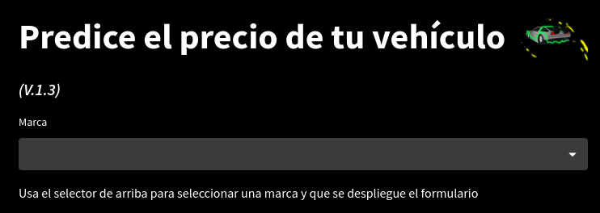

# Proyecto de Machine Learning - Predicción de precios de coches de 2ª mano

(Detalles del proyecto en proceso)

Versión actual: ***V.2***

## Concepto

Tengo un concesionario multimarca en el cual disponemos de varios vehículos de segunda mano adquiridos recientemente para su venta, para establecer el precio, he decidido usar Machine Learning, el cual, bajo un entrenamiento previo de los precios del mercado de segunda mano, es capaz de decirme cual sería el mejor precio de venta para estas últimas adquisiciones.

El dataset que he utilizado lo puedes encontrar en kaggle:

## Tecnologías usadas

## Aplicación

Puedes probar la aplicación aquí:

### 1. Preparación de los datos

Puedes ver la preparación de los datos aquí:

### 2. Desarrollo

En la siguiente imagen se representa el desarrollo para el selector de marca:

En la aplicación se ve así:

La siguiente imagen se puede ver donde monto el array para pasarselo al metodo predic que se vera la siguiente imagen a esta:

La siguiente imagen se puede ver donde hago la predicción y hago que se muestre por pantalla pasando el resultado por la función `convertidor` para sacar el precio con la divisa correcta:

En la siguiente imagen se muestran las funciones para el procesado de los datos del formulario:

Consta de 4 funciones:

Función `extract_index`:

Esta función se encarga de extraer el indice al que corresponde a un modelo en un diccionario, por ejemplo el modelo A1 tiene el indice 0, esto es importante, puesto que para predecir un vehiculo hay que indicarle a que modelo pertenece y la predición de el valor correcto para dicho modelo.

El proceso de creación del diccionario lo puedes ver aquí: 

Función `modelTransmission`:

Esta función lo que hace es darle un valor numerico a cada tipo de caja de cambios:

Función `combustibleType`:

Aquí hago lo mismo que en la función anterior pero para cada tipo de combustible:

Función `convertidor`:

Esta función lo que hace es convertir el valor obtenido por la predicción en la divisa que el usuario desee:

